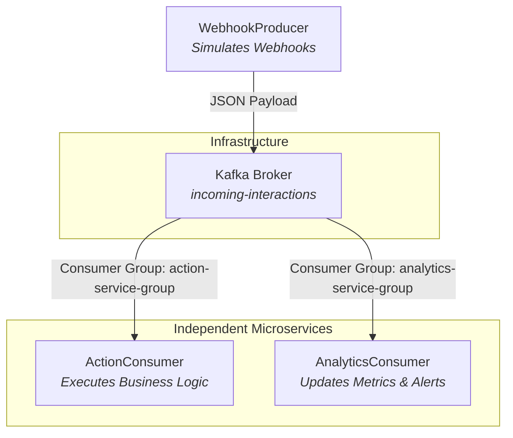

# 🚀 Apache Kafka Playground: Real-Time Event Simulation

A sleek, lightweight Java application demonstrating an **event-driven architecture** using Apache Kafka. This project serves as a fully functional playground for testing Kafka integration, serializing/deserializing structured JSON payloads, and managing independent consumer groups in a local environment.

---

## 📐 Architecture & Flow

This project simulates a real-world scenario where a web service produces interaction events (e.g., social media webhooks) that are simultaneously processed by separate downstream services.



### 1. Webhook Simulator (`WebhookProducer`)
Generates randomized user activity events every second and publishes them to the Kafka topic.
* **Payload Type:** `InteractionEvent` JSON (eventId, username, interactionType, content, timestamp)
* **Event Types:** `DIRECT_MESSAGE`, `COMMENT`, `LIKE`

### 2. Action Service (`ActionConsumer`)
Responsible for executing automated reactions to incoming events.
* **Consumer Group:** `action-service-group`
* **Actions:**
  * **Direct Messages:** Triggers an automated greeting message.
  * **Comments:** Runs a mock profanity check.
  * **Likes:** Increments the user's like counter.

### 3. Analytics Service (`AnalyticsConsumer`)
Responsible for tracking metrics and triggering security/moderation alerts.
* **Consumer Group:** `analytics-service-group`
* **Metrics:**
  * Increments metrics for all event types.
  * Triggers a `[ALERT]` warning if a user posts a message longer than 30 characters.

---

## 🛠️ Tech Stack & Prerequisites

* **Runtime:** Java 17+
* **Build System:** Maven 3.x+
* **Messaging:** Apache Kafka (KRaft mode via Docker)
* **Monitoring:** Provectus Kafka UI
* **JSON Processing:** Jackson Databind

---

## ⚡ Quick Start Guide

Follow these steps to run the complete event streaming demo on your local machine.

### Step 1: Start Kafka & Kafka UI

We run Kafka in self-contained **KRaft mode** (no Zookeeper required) along with a rich web dashboard.

```bash
docker compose up -d
```

Verify that the containers are healthy:
* **Kafka Broker:** `localhost:9092`
* **Kafka UI Dashboard:** [http://localhost:8080](http://localhost:8080)

---

### Step 2: Build the Application

Use Maven to compile the source code and prepare dependencies:

```bash
mvn clean compile
```

---

### Step 3: Run the Microservices

For the best experience, open three separate terminal windows to monitor the logs side-by-side.

#### 1. Start the Consumers (Listeners)
Start both consumers first so they are ready to process events instantly.

**Terminal A - Action Consumer:**
```bash
mvn exec:java -Dexec.mainClass="com.example.ActionConsumer"
```

**Terminal B - Analytics Consumer:**
```bash
mvn exec:java -Dexec.mainClass="com.example.AnalyticsConsumer"
```

#### 2. Start the Event Producer
Now, start producing events to see the pipeline in action.

**Terminal C - Webhook Simulator:**
```bash
mvn exec:java -Dexec.mainClass="com.example.WebhookProducer"
```

---

## 📊 Visualizing in Kafka UI

Open [http://localhost:8080](http://localhost:8080) in your web browser. From the dashboard, you can:
* **View Topics:** Inspect the auto-created `incoming-interactions` topic.
* **Monitor Consumers:** Inspect the state of `action-service-group` and `analytics-service-group` to verify consumer offsets.
* **Inspect Messages:** Watch the raw JSON event stream in real-time under the "Messages" tab.

---

## 🔧 Useful Development & Troubleshooting Commands

### Check Active Consumer Groups
To list all active consumer groups in your Kafka broker:
```bash
docker exec -it kafka-broker kafka-consumer-groups --bootstrap-server localhost:9092 --list
```

### Describe a Specific Consumer Group
To check lag or active members for a consumer group:
```bash
docker exec -it kafka-broker kafka-consumer-groups --bootstrap-server localhost:9092 --describe --group action-service-group
```

### Consume Messages manually from CLI
If you want to view raw messages directly from the terminal:
```bash
docker exec -it kafka-broker kafka-console-consumer --bootstrap-server localhost:9092 --topic incoming-interactions --from-beginning
```

---

## 📦 Project Structure

```text
├── docker-compose.yml      # Kafka & Kafka UI docker definition
├── pom.xml                 # Maven dependencies (Kafka clients, Jackson, Slf4j)
├── README.md               # You are here!
└── src
    └── main
        └── java
            └── com
                └── example
                    ├── ActionConsumer.java     # Process-oriented consumer
                    ├── AnalyticsConsumer.java  # Stats & Alert consumer
                    ├── WebhookProducer.java    # Mock event producer
                    └── DTO
                        └── InteractionEvent.java # Jackson POJO Model
```
